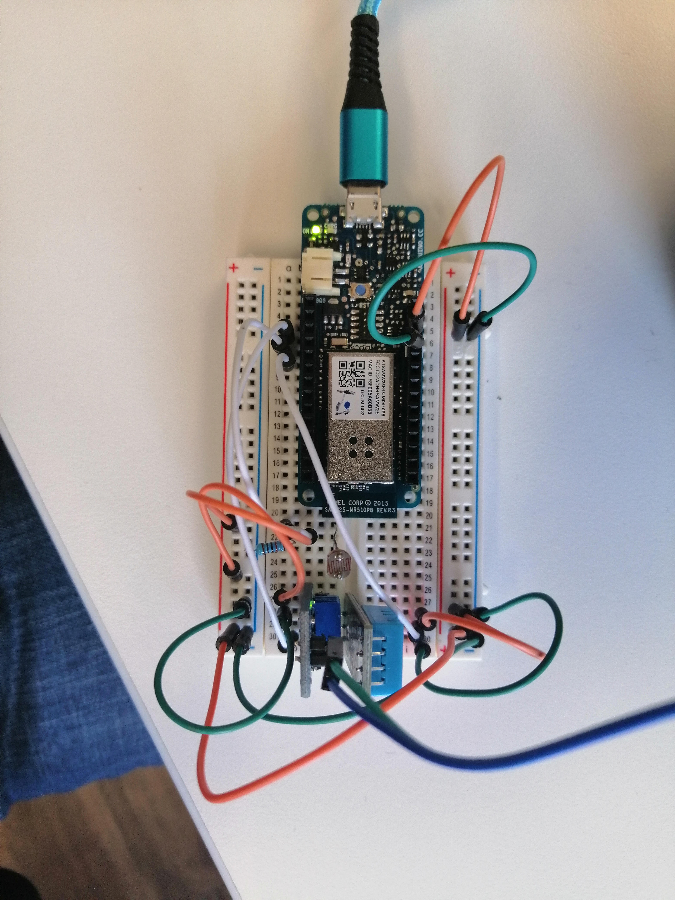
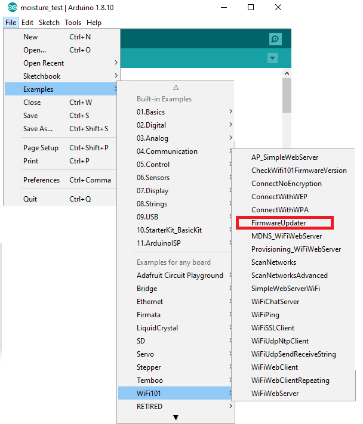
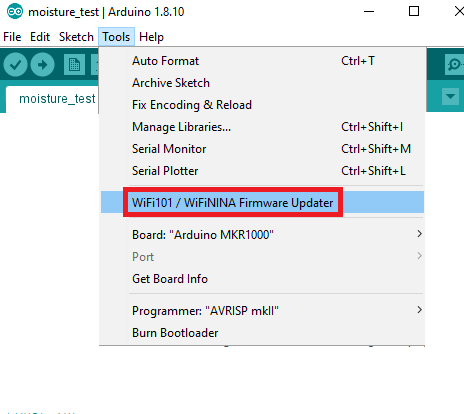

# Peashooter - the Robot Plant Device

Peashooter allows you to easily monitor the conditions that your beloved plant is currently in, such as the surrounding temperature, humidity, light and soil moisture. This should help you to ensure that your plant is always under the right conditions to grow.

## Hardware

To recreate the Peashooter project, you will need the following hardware:

[Arduino MKR1000]( https://www.amazon.co.uk/Quality-GL5516-Dependent-Resistor-Photoresistor/dp/B00NXW9WZ6/ref=sr_1_3?keywords=photoresistor&qid=1574168465&s=gift-cards&sr=8-3 )

[Arduino 400 tie-point Breadboard]( https://www.amazon.co.uk/ELEGOO-tie-points-breadboard-Arduino-Jumper/dp/B0739XRX8F/ref=sr_1_4?keywords=arduino+mini+breadboard&qid=1574168201&s=electronics&sr=1-4 )

[Male-to-Male Jumper Cables]( https://www.amazon.co.uk/40pcs-2-54mm-Breadboard-jumper-Arduino/dp/B00DRAI8CC/ref=sr_1_19?keywords=arduino+male+to+male+jumper+wires&qid=1574168257&s=electronics&sr=1-19 )

[DHT11 Temperature and Humidity Sensor Module]( https://www.amazon.co.uk/DollaTek-Temperature-Humidity-Digital-Raspberry/dp/B07DK8MVNX/ref=sr_1_5?keywords=arduino+dht11&qid=1574168359&s=electronics&sr=1-5 )

[Soil Moisture Sensor]( https://www.amazon.co.uk/ARCELI-Hygrometer-Moisture-Detection-Arduino/dp/B07CQT5RC8/ref=sr_1_6?keywords=arduino+soil+moisture+sensor&qid=1574168413&s=electronics&sr=1-6 )

[LDR Photoresistor]( https://www.amazon.co.uk/Quality-GL5516-Dependent-Resistor-Photoresistor/dp/B00NXW9WZ6/ref=sr_1_3?keywords=photoresistor&qid=1574168465&s=gift-cards&sr=8-3 )

10k Ohm Resistor

**Note: this project can also be solar-powered so that it can run independently. For this feature, you will need these extra components:**

[Solar Cell]( https://www.amazon.co.uk/ALLPOWERS-500mAh-Encapsulated-Battery-Charger/dp/B073XKPWY7/ref=sr_1_5?dchild=1&keywords=solar+panel+diy&qid=1574088656&sr=8-5 )

[1N4007 Diode]( https://www.amazon.co.uk/Gikfun-1N4007-Plastic-Rectifier-Arduino/dp/B01J7P35U0/ref=sr_1_3?keywords=in4007&qid=1574162696&refinements=p_76%3A419158031&rnid=419157031&rps=1&s=electronics&sr=1-3 )

[RTC Module](https://www.amazon.co.uk/iHaospace-DS3231-AT24C32-Precision-Arduino/dp/B07CG7YTPN/ref=sr_1_6?crid=21B61ROBU5UW2&keywords=rtc+ds3231&qid=1574162831&sprefix=rtc%2Caps%2C156&sr=8-6)

[Rechargeable AA NiMH Batteries](https://www.amazon.co.uk/dp/B00HZV9TGS/ref=twister_B07CMCHMYV?_encoding=UTF8&th=1)

[Battery Charging Case](https://www.amazon.co.uk/HALJIA-Plastic-Battery-Storage-Holder/dp/B06WLHFXSH/ref=sr_1_3?keywords=aa+battery+holder&qid=1574162956&sr=8-3)

[Boost Converter](https://www.amazon.co.uk/ARCELI-Control-Converter-Charger-0-9V-5V/dp/B07MY2HYD2/ref=pd_rhf_ee_p_img_13?_encoding=UTF8&psc=1&refRID=P6XYPTFPNMZY04GEPH1N)

You will also need a soldering iron to assemble the solar circuit.

## Assembly

You will need to now assemble the components into a circuit. Use the circuit diagram below to help put your device together.

Here is a picture of a fully assembled sensor device:

## Software

### Libraries

Next, you will need to load the correct firmware onto the Arduino board. First of all, you will need to download two libraries that the device will need:

[WiFi101]( https://github.com/arduino-libraries/WiFi101 )

DHT11

Add these libraries as ZIP files to the Arduino sketch in this repository.

### Setup

Next, you will need to set up the Arduino board to work with your DSS server. In the Arduino IDE with your MKR 1000 connected, go to `File` > `Examples` > `WiFi101` > `FirmwareUpdater`.

Once this sketch is open, upload it to the Arduino and wait for the transfer to complete. After it is done, go to `Tools` > `WiFi101 / WiFiNINA Firmware Updater`.

Next, select your board in the list of available boards. If it is not there, click Refresh until it appears. Next, ensure that the selected firmware in section two contains `Arduino/Genuino MKR1000`. Click `Update Firmware` and wait for the software to flash the newest firmware to the board. Finally, in section three, click `Add Domain` and enter the same hostname that you entered into the Arduino sketch earlier. Wait for it to resolve the certificate for your DSS instance, and then click on `Upload Certificates to WiFi module`. This will now upload the SSL certificate for your instance to the Arduino so that it can establish a secure connection to the server. Now you can close the tool and `FirmwareUpdater` sketch.

Now that you have set up the Arduino board, you can upload the sketch from this repository to the board from the Arduino IDE.  Once the sketch is uploaded, the Arduino will start to transmit data every five minutes whenever it is powered on.

## Solar Power

If you want to add solar power to your project to make it fully autonomous, follow the guide [here]( https://www.instructables.com/id/SOLAR-POWERED-ARDUINO-WEATHER-STATION/ ) to make your solar circuit out of the components listed earlier. Once you have USB power supplied by your solar circuit, you can connect a Micro USB cable to the powered USB output in order to power your Arduino.